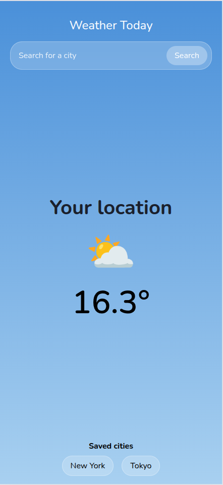
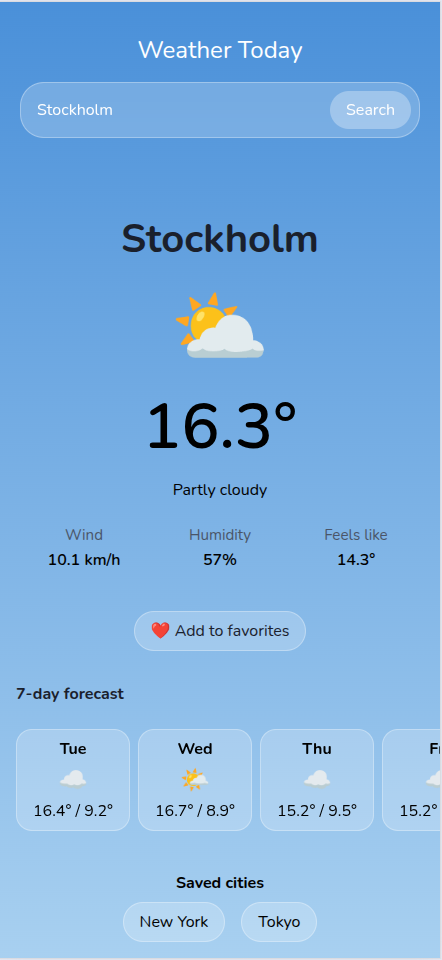
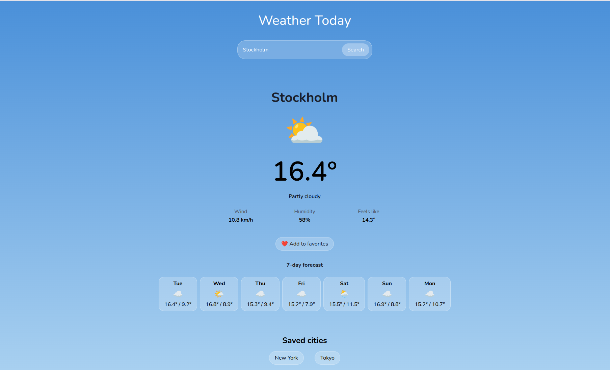

# Weather Today App

A mobile-first weather app built with React, letting users search for any city's current weather and 7-day forecast, save favorite cities, and see weather at their current location.

## Live Demo

[https://react-weather-app-jet-pi.vercel.app](https://react-weather-app-jet-pi.vercel.app)

## Screenshots




## Features

- Search for any city's current weather and 7-day forecast
- View weather based on your current location (with fallback if location access is denied)
- Save and remove favorite cities, persisted between sessions
- Responsive design, optimized for mobile and adapted for desktop
- Clear loading and error states, including a distinct "no results found" message


## Tech Stack

- React (Vite)
- React Router
- Axios
- CSS Modules
- [Open-Meteo API](https://open-meteo.com/) (weather data and geocoding, no API key required)

## Project Structure
```
src/
├── api/          # Functions for calling the Open-Meteo API
├── components/   # Reusable, presentation-focused components
├── context/      # React Context for shared favorites state
├── hooks/        # Custom hooks (data fetching + state)
├── layout/       # App-wide layout (header, favorites)
├── pages/        # Route-level views (overview, detail, error)
└── utils/        # Helper functions (weather code mapping, forecast data shaping, geolocation)
```


## Getting started

1. Clone the repository: 
```
git clone https://github.com/css95/react-weather-app.git
cd react-weather-app
```
2. Install dependencies:
```
npm install
```
3. Run the development server:
```
npm run dev
```
4. Open the local URL shown in your terminal (typically http://localhost:5173)

## Requirements Met

### Godkänd (G)

- [x] 5+ components with single responsibility, organized folder structure (`components/`, `pages/`, `hooks/`, `api/`, `utils/`, `context/`, `layout/`)
- [x] Routing between two views (overview and detail) via React Router, no full page reload
- [x] Shared state via Context (favorites), used across multiple components
- [x] API integration (Open-Meteo) with loading and error handling
- [x] Form with validation (city search), with clear feedback on invalid/empty input
- [x] Persistence via localStorage (favorites), including error handling for corrupted/missing data
- [x] Consistent naming and formatting, no unused variables or console.logs
- [x] Committed to Git with an incremental commit history

### Väl Godkänd (VG)

- [x] **Extended error handling**: distinct empty states ("no results found", "no saved cities yet") separate from generic network error handling
- [x] **Thought-out component architecture**: custom hooks (`useWeather`, `useLocationWeather`) separate data-fetching from presentation; reusable components (`WeatherCard`, `WeatherSummary`, `ForecastList`)
- [x] **Responsive design**: built mobile-first, with desktop breakpoints adjusting layout, spacing, and sizing
- [x] **Extended functionality relevant to the app idea**: saved favorite cities, geolocation-based weather with fallback, 7-day forecast
- [x] **Ongoing, descriptive commit history** throughout development, not only at the end